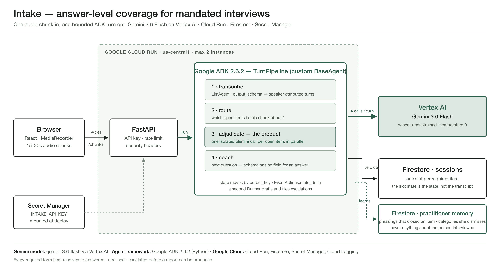

# Intake

**Your second chair. Nothing leaves the room unanswered.**

Intake is a Collaborative Partner agent for professionals who run a structured
interview against a mandated form — a community nurse doing a care assessment,
an insurance loss adjuster inspecting damage, a safety inspector on site.

It listens to the conversation, tracks which required items have received a
**substantive answer**, surfaces the remaining gaps **while the interview is
still running and the person can still answer**, and resolves every mandatory
item before producing the report.

> Every AI scribe tells you what you said. Intake tells you what you haven't
> asked yet.

---

## For reviewers and judges

**Hosted:** https://intake-agent-320877670799.us-central1.run.app

It scales to zero, so the *first* request after an idle period takes ~15s to
cold-start and any request before that may time out. Hit `/health` once and wait
for `{"ok":true,"store":"FirestoreStore"}` before trying the UI.

The API is gated by a shared key sent as an `X-Intake-Key` header — an open
endpoint is an open wallet, since every request spends Vertex AI credit. The key
for reviewers is in the Devpost submission's testing-instructions field, not in
this repo. Paste it into the web client when prompted, or:

```bash
curl -s https://intake-agent-320877670799.us-central1.run.app/health
curl -s -H "X-Intake-Key: <key from the submission form>" \
     -H "Content-Type: application/json" \
     -d '{"template_id":"community-nursing-v1","practitioner_id":"reviewer"}' \
     https://intake-agent-320877670799.us-central1.run.app/sessions
```

`practitioner_id` is a free-text label, not a login — it scopes the session and
is the ADK `user_id`. Any value works.

**Nothing to install to evaluate the core claim.** The product's whole argument
is the adjudicator, and it is scoreable in one command against 47 labelled cases
— see *Verify the adjudicator before anything else* below.

**Model and framework, stated plainly:** Gemini **3.6 Flash** via **Vertex AI**,
orchestrated with **Google ADK 2.6.2 (Python)**, on **Cloud Run** with
**Firestore** and **Secret Manager**.

## The distinction that matters

Existing tools tick an item when it is **mentioned**. Intake ticks when it is
**answered**.

Ask *"falls in the last 12 months"* and get *"oh, I've had a couple of
wobbles"* — a mention-level tracker marks the topic covered. Intake does not.
It keeps the item open and says what's still needed: a count and the
circumstances.

## Nothing is ever silently blank

Before Intake will produce a report, every mandatory item resolves into
exactly one of three states:

| State | Meaning |
|---|---|
| **Answered** | With the transcript span it was drawn from, as evidence |
| **Declined** | Formally recorded as declined, with a reason |
| **Escalated** | The agent drafts and files a follow-up action: what is outstanding, why it could not be closed, and where it needs to go |

The gate is a router, not a wall. It never forces a fabricated answer and it
never lets an omission pass silently.

## Architecture



```
React (browser)                       Google Cloud
┌───────────────────────┐            ┌──────────────────────────────────────┐
│ mic → 18s chunks      │──POST────▶ │ Cloud Run · FastAPI + ADK 2.6.2      │
│ local queue + replay  │            │  TurnPipeline — custom BaseAgent     │
│                       │            │   1. transcriber   LlmAgent          │
│ coverage ring         │            │   2. route         narrows the set   │
│ next-question card    │            │   3. adjudication  custom BaseAgent  │
│ highlight chips       │            │      └─ one call per open item,      │
│ three-state gate      │            │         fanned out concurrently      │
│ report editor         │◀───────────│   4. coach         LlmAgent          │
└───────────────────────┘            │ Vertex AI gemini-3.6-flash           │
                                     │ Firestore · Secret Manager           │
                                     └──────────────────────────────────────┘
```

Not a `SequentialAgent`, and not the `Workflow` graph. Both emit events with no
`content`, which ADK's own eval tooling rejects outright — so behavioural
evaluation is impossible on either. A custom `BaseAgent` is four lines and every
event in the trace is one we deliberately emitted. Measured, with the event
streams, in [ADR-0013](docs/adr/0013-no-workflow-graph-migration.md).

Each chunk costs one transcription call, one adjudication call **per still-open
item** run concurrently, and one coaching call. Adjudication is fanned out
rather than folded into a single prompt so that a wrong verdict on one item
cannot corrupt another, and so each item's judgement is separately scoreable by
`eval/`.

The **slot state is the state**, not the transcript. The coach sees a brief of
open items and this chunk's quotes; adjudication sees a 12-turn window. Context
stays bounded regardless of interview length — a three-hour session costs the
same per chunk as a ten-minute one.

See `docs/ARCHITECTURE.md` for detail and `docs/adr/` for why.

## Where things are

Judges asked for this, and it is genuinely the fastest way in. The adjudicator
and the eval are the two files that matter; everything else supports them.

```
backend/intake_agent/
  adjudicator.py   THE PRODUCT — one schema-constrained Gemini call per item,
                   decides answered vs mentioned against the guidance note
  agent.py         the ADK pipeline: TurnPipeline (custom BaseAgent),
                   the fanned-out adjudication stage, and the Escalator
  memory.py        what the agent learns across interviews, and the guard
                   that stops it ever learning about an interviewee
  router.py        narrows which open items a chunk can possibly bear on
  store.py         Firestore session state + practitioner memory
  template.py      the form-as-config engine (ADR-0003) — zero domain logic
  report.py        assembles the report from recorded state; no model call
  main.py          FastAPI surface, API key, rate limit, security headers
backend/adk_apps/intake/
  agent.py         module-level root_agent, for adk web / agents-cli eval
backend/tests/     131 tests, no network — every model call is stubbed
backend/tests/eval/ behavioural eval over the pipeline (deterministic metrics)
eval/
  run_eval.py      THE GATE — 47 labelled cases, exits non-zero if an answer a
                   human called insufficient is ever marked sufficient
  cases/           the labelled cases, 12 of them adversarial
templates/         the forms. Two professions, one engine, no code difference
web/src/           React client: mic → chunks → coverage ring → three-state gate
docs/adr/          why each decision was made, including the ones reversed
docs/diagrams/     architecture, sequence, orchestration (archify + static PNG)
demo/              the demo video pipeline: script, voices, capture, mux
```

**If you only open two files:** `backend/intake_agent/adjudicator.py` for the
judgement, and `eval/run_eval.py` for the proof it holds.

## Spin-up

### Prerequisites

- A Google Cloud project with billing enabled and the Vertex AI API on
- `gcloud auth application-default login`
- Python 3.11+ with [`uv`](https://docs.astral.sh/uv/), and Node 20+

### 1. Configure

```bash
cp .env.example .env
# edit .env: GOOGLE_CLOUD_PROJECT, and leave GOOGLE_GENAI_USE_VERTEXAI=TRUE
gcloud services enable aiplatform.googleapis.com firestore.googleapis.com \
  run.googleapis.com cloudbuild.googleapis.com secretmanager.googleapis.com
```

If your shell exports `GOOGLE_APPLICATION_CREDENTIALS`, **unset it**. A service
account key file in that variable silently overrides
`gcloud auth application-default login`, so every call authenticates as that
service account against whichever project owns it — including, if you are not
watching, a completely different one from the project in your `.env`.

```bash
unset GOOGLE_APPLICATION_CREDENTIALS
```

Firestore must be in **native mode**. If your project's default database is in
Datastore mode, create a named one and point at it:

```bash
gcloud firestore databases create --database=intake --location=us-central1 --type=firestore-native
echo 'FIRESTORE_DATABASE=intake' >> .env
```

You can also skip Firestore entirely — set `INTAKE_STORE=memory` and everything
runs, minus durability. `GET /health` always tells you which store is live.

### 2. Reproducible testing — verify the adjudicator before anything else

The adjudicator is the product, so it is the first thing to run:

```bash
uv run --group dev pytest backend/tests -q   # 134 tests, no network
cd eval && uv run python run_eval.py         # 47 labelled cases, real Vertex calls
```

`run_eval.py` prints a confusion matrix and **exits non-zero if any answer
labelled insufficient was marked sufficient**. Current score: **precision on `sufficient` 100%** — the gate property, and the
number that is stable. Accuracy moves between runs (45–46 of 47): the
adjudicator is occasionally stricter than a labelled case, and every such miss
is a false *insufficient*, which costs one extra question and never a wrong tick over 47 cases, with one deliberate non-critical miss.
Do not move on to the UI until this passes.

### 3. Run it locally

```bash
# terminal 1 — agent service
set -a && . ./.env && set +a
uv run uvicorn intake_agent.main:app --port 8000 --app-dir backend

# terminal 2 — web client
cd web && npm install && npm run dev      # http://localhost:5173
```

Pick a template, press **Start recording** and grant microphone permission — or
type turns into the box beside it, which drives the identical pipeline and is
the fallback when the room is too noisy to record.

### 4. Deploy to Cloud Run

```bash
printf 'choose-a-long-random-string' | gcloud secrets create intake-api-key --data-file=-
./backend/deploy.sh
```

`deploy.sh` builds the web client and ships it inside the image, so the deployed
URL serves the app itself rather than a bare API. It builds with an empty
`VITE_API_BASE`, meaning "call my own origin" — there is no separate client
build step and no CORS surface.

**The access code is never built in.** Vite inlines `import.meta.env.*` at build
time, so a `VITE_API_KEY` would ship readable inside the JS bundle — a published
credential to an endpoint that spends money on Vertex AI per request. The app
asks for the code instead and keeps it in the browser's `localStorage`; a
`?key=…` parameter also works and is stripped from the address bar.

Every request that costs money requires `X-Intake-Key` and is rate limited per
key. The service refuses to start ungated: with no `INTAKE_API_KEY` set it
answers 503 unless `INTAKE_ALLOW_UNGATED=1` is set explicitly, which belongs in
local `.env` and never in a deploy.

## Templates

The entire vertical lives in a JSON template. No domain logic exists in code.

```jsonc
{
  "id": "M14",
  "prompt": "Falls in the last 12 months",
  "required": true,
  "answer_type": "structured",
  "high_risk": true,          // no AI suggestion — quote only, human writes it
  "accepts_declined": true,   // "declined, reason X" is a real answer
  "guidance_ref": "§3.4",     // where the guidance note came from
  "guidance": "A sufficient answer records the number of falls and the circumstances of the most recent occurrence. Vague quantifiers such as 'a few' are not sufficient.",

  // Conditional items become required only when the condition holds.
  // `when` is a closed set — answered | answered_and_matches — not an
  // expression language: templates are authored by domain experts, and an
  // eval'd expression in a config file is an injection surface.
  "depends_on": { "item": "M14", "when": "answered_and_matches", "pattern": "(?i)\\b(one|two|three|[1-9][0-9]*)\\b" }
}
```

The `guidance` note is what the adjudicator judges against, and it is
authoritative over the model's own taste. That is the whole mechanism: change
the note, change what counts as an answer, with no code change.

`templates/` holds two synthetic examples — community nursing and insurance
loss adjusting. Swapping between them requires no code change; that is the
point, and it is the test of whether the engine is honestly decoupled.

**Real client or employer forms are never committed.** `templates/private/`
and `*.private.json` are gitignored. The examples here are derived from
published standards.

## Privacy by architecture

Intake **never solicits, indexes or keys on the identity of the person being
interviewed.** There is no name field, no subject identifier, and no
per-subject history; sessions are scoped to a job, not a person.

Stated precisely, because the honest version is narrower than the slogan:
recorded answers are **verbatim quotes**, and a real interviewee may say a name
in passing — *"my daughter Sarah drives me on Mondays"*. That span is stored as
spoken, because quoting exactly is the evidence the product rests on and
redacting it would break adjudication. What follows from that is a retention
answer rather than a redaction one: quotes live in the session document, they
are never copied into logs, and they are deleted when the session is.

Persistent memory is scoped to the *practitioner*: which highlight categories
she dismisses, how she phrases questions, her report voice.

## Scope of the agent's judgement

Intake tracks coverage against a human-authored form and quotes the transcript
span it relied on. It reports that *"item M14 has no recorded answer"* — never
that *"this may indicate falls risk"*. It does not diagnose, rank, recommend,
or imply a clinical or professional next action. For items marked `high_risk`
it offers no suggested answer at all: it shows the quote and the human writes
the answer.

## Known limitations

Stated here rather than left to be found. Each is a decision with a reason, not
an oversight.

**Access control is a capability model, not per-user auth.** One shared API key
gates the service, and a session is addressed by an unguessable 128-bit id. Any
key holder who *has* an id can act on that session. Nobody can enumerate ids,
but the model stops being defensible the moment one reaches a log, a referrer,
or a shared screen. The fix is Firebase Auth plus an owner field on the session
document — designed in [ADR-0012](docs/adr/0012-firebase-auth-not-a-shared-secret.md),
deliberately not attempted in the last fortnight before a deadline.

**Concurrent writes to one session can lose an update.** Firestore writes are
read-modify-write without a transaction, so two chunks landing at once means
last-writer-wins. The browser serialises chunk POSTs, so it does not happen in
normal use, and the replay guard makes a duplicate chunk a no-op — but the guard
is itself read-modify-write, so it is not airtight either. The fix is a
transactional `_mutate` on the store.

**Rate limiting is per instance.** 20 requests/minute per key, held in process,
so with `--max-instances=2` the real ceiling is 40 and it resets on a cold
start. Adequate while there is one key; a Firestore counter when there are real
users.

**Cloud Trace is wired and disabled.** The exporter is configured and no span
was ever observed arriving. Shipped off rather than as a flag that lies about
what it does.

**Practitioner memory is deliberately narrow.** It learns question phrasings
that worked and categories she dismisses — nothing else, and nothing about the
people interviewed (ADR-0014). Report voice is documented in the schema and not
yet implemented. Phrasings are also not shared between practitioners, so a new
user starts cold.

## Licence

[PolyForm Noncommercial 1.0.0](LICENSE.md) — source-available, free for any
noncommercial purpose, and free to read, fork and run for the judging of this
contest. Commercial use requires a separate licence. This is deliberately not
an OSI-approved open-source licence; the contest requires a public repo, not a
permissive one.

## Built for

[All Things Agentic Hackathon](https://allthingsagentichackathon.devpost.com/)
— Collaborative Partner track. Gemini 3.6 Flash via Vertex AI · Google ADK
(Python) · Cloud Run · Firestore.
