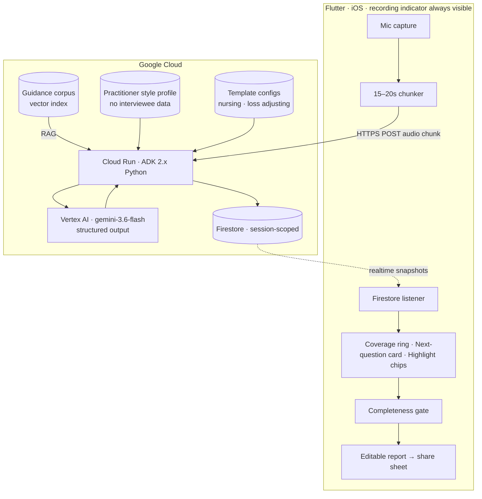

# Second Chair — Build Spec v2

**Contest:** [All Things Agentic Hackathon](https://allthingsagentichackathon.devpost.com/) · Google LLC / Devpost
**Track:** Collaborative Partner ($20,000) · also targeting Individual/Hobbyist Best Solo Build ($10,000, 2 winners)
**Window:** 4 Aug – **31 Aug 2026, 5:00pm PT** · Judging 1 Sep – 1 Oct · Winners ~8 Oct
**Stack:** Flutter on iOS · ADK Python on Cloud Run · Gemini 3.6 Flash via Vertex AI · Firestore
**Supersedes** `clipboard-build-spec.md`. Changes: renamed; all interviewee identity removed; memory re-pointed at the practitioner; demo restructured; App Store question answered.

---

## 1. The name

**Second Chair.**

In a courtroom, the second chair doesn't argue the case. They sit beside the person who does, track what's been covered, and hand them what they need next. That is exactly this product — and it is also, precisely, the regulatory and ethical posture: **the human remains the interviewer, always.** The agent never conducts, never decides, never diagnoses. It keeps track and hands things over.

It's a better name than Clipboard or Doorstep because it names the *role* rather than the object, it's industry-neutral, it avoids the AI-assistant-copilot-companion cliché entirely, and it gives you your video's opening line for free:

> *"In a courtroom, the second chair doesn't argue the case. They keep track of what's been covered and hand you what you need next. That's what we built — for anyone who has to run a structured interview and file a report afterwards."*

Alternates if it doesn't land: **Formwork** (the temporary structure that shapes something until it sets, then comes away), **Docket**, **Roundsheet**.

---

## 2. What changed, and why the identity decision is a real upgrade

You said: don't record who was interviewed — it's a workflow companion, the content is what matters. That's right, and it improves the project in four ways at once.

**It simplifies the build.** No person records, no identity resolution, no per-subject history. Sessions are scoped to a job, not a human.

**It removes an entire class of legal exposure.** No personal data of the interviewee is stored at all. Not a name, not an identifier. The audio is processed to fill slots and then the transcript can be discarded on session close. That is a *much* stronger position than any scribe on the market, all of which are built around a patient or client record.

**It sharpens the pitch.** "We never store who you spoke to" is a memorable, differentiating line, and it's true by architecture rather than by policy.

**And critically, it fixes my memory design.** I had just made per-client prior-visit retrieval a headline feature. Drop it — but note the track's actual wording:

> *"...so it constantly adapts to **the user's** unique way of thinking."*

The user is the practitioner. Memory was pointed at the wrong party. Re-pointing it at her is both PII-free *and* a closer match to the rules than what I proposed last round. §4 does this properly.

---

## 3. Architecture: one config artifact drives everything

Second Chair is a **template interpreter**. Nothing about nursing, loss adjusting or safety inspection lives in code — it all lives in config, and that fact *is* the 30% Architectural Discipline story ("how well did you decouple systems").

```jsonc
{
  "template_id": "community-nursing-initial-assessment",
  "display_name": "Community Nursing — Initial Assessment",
  "guidance_corpus": "gs://second-chair/guidance/nursing-assessment-notes.pdf",
  "sections": [{
    "id": "mobility",
    "title": "Mobility and falls",
    "items": [
      {
        "id": "M14",
        "prompt": "Falls in the last 12 months",
        "required": true,
        "answer_type": "structured",
        "high_risk": true,            // → no AI suggestion; quote-only
        "accepts_declined": true,     // → "declined, reason X" is a real answer
        "guidance_ref": "p12 §4.2"    // → RAG target for phrasing the question
      },
      {
        "id": "M14a",
        "prompt": "Circumstances of most recent fall",
        "required": true,
        "depends_on": { "item": "M14", "when": "count > 0" }   // skip logic
      }
    ]
  }],
  "highlight_taxonomy": ["safeguarding", "equipment_need", "medication_change"],
  "report": { "format": "markdown", "sections": ["summary", "by_section", "flags"] }
}
```

Six fields, each doing real work and each a demo beat:

| Field | What it drives |
|---|---|
| `required` | The completeness gate — **the Twist** |
| `depends_on` | **Conditional branching.** Real mandated forms are full of skip logic, and following it correctly mid-conversation is genuinely hard for a human and trivial for an agent. This is one of the strongest "guide the user step-by-step" features available and it costs almost nothing |
| `high_risk` | The guardrail — agent offers no suggestion, shows the transcript quote, human writes the answer |
| `accepts_declined` | The gate accepts "declined, reason given" rather than forcing a fabrication. The detail that makes it feel designed by someone who met a real workflow |
| `guidance_ref` | RAG target (§4) |
| `answer_type` | Structured extraction shape |

The healthcare template can *additionally* be expressed as a FHIR `Questionnaire` emitting a `QuestionnaireResponse` — cheap credibility with a healthcare-literate judge. Keep it an **optional adapter over the generic schema**, never the core format, or the generality story dies.

**Draft architecture diagram** (a submission requirement — refine as the build settles):



---

## 4. Memory and RAG — both PII-free, both load-bearing

The track demands "stateful, multi-turn dialogue with real-time context retrieval (RAG) and persistent memory". Here's how to satisfy it without storing a single fact about any interviewee.

**RAG over the form's own guidance notes.** Mandated forms almost always ship with an accompanying guidance document explaining what each item means, what counts as an adequate answer, and what the common errors are. Index that corpus. When item M14 comes up, retrieve its guidance and use it to phrase the question properly and to judge whether what was said actually satisfies the item. This is real retrieval with a real purpose, it demonstrably improves output quality, and it contains no personal data whatsoever. It also gives you a strong answer to "why not just prompt Gemini with the form?" — because the form alone doesn't tell you what a *sufficient* answer looks like.

**Memory scoped to the practitioner, not the subject.** Every confirm or dismiss of a proposed highlight is a labelled signal, collected as a side effect of work she was doing anyway — no thumbs-up widget. Store per-practitioner:

- highlight-category acceptance rates → dismiss `equipment_need` three times and it stops being proposed; accept `safeguarding` consistently and it surfaces earlier
- question phrasing → if she systematically shortens suggested wording, generate shorter
- report voice → learn from her edits to generated report prose
- pacing → whether she prefers one nudge at a time or a running list

All keyed to her user ID. None of it references anyone she interviewed.

**How to demo adaptation honestly in 20 seconds:** run the same template twice on camera. In the first pass, dismiss a category twice. In the second, it isn't proposed, and one you accepted appears first instead. Both passes are live; the state between them is real Firestore state. No mocking, no faking.

Firestore is sufficient — you don't need Vertex AI Memory Bank, and hand-rolling the profile is cheaper and much easier to explain on the architecture diagram.

---

## 5. App Store — no. Here's the actual answer

**The hackathon rules neither require nor forbid it.** I grepped the full rules and FAQ for "app store", "Play Store", "TestFlight", "install", "iOS", "Android", "APK", "binary". There is **no mention of app stores anywhere.** The only relevant clauses are permissive: *"Include a URL to the hosted Project (if available)… such as web UI, Chrome Extension, mobile app, etc."* and, in the Testing clause, *"a link to a website, functioning demo, **or a test build**"* — followed by *"Judges are not required to test the Project and may choose to judge based solely on the text description, images, and video."*

**But don't ship to the App Store, for four concrete reasons.**

**Apple's own guidelines say a hackathon build doesn't belong there.** Guideline **2.2**: *"Demos, betas, and trial versions of your app don't belong on the App Store – use TestFlight instead."* Reinforced by **2.1(a)**: submissions *"should be final versions"* and *"We will reject incomplete app bundles."*

**Guideline 5.1.1(ix) is a probable hard block.** *"Apps that provide services in highly regulated fields (such as banking and financial services, **healthcare**, gambling, legal cannabis use, air travel and crypto exchanges) or that require sensitive user information **should be submitted by a legal entity that provides the services, and not by an individual developer.**"* If your Apple account is Individual rather than Organization and the app is positioned for clinical field work, that's grounds for rejection — and switching enrollment requires D-U-N-S verification, which takes weeks. Not fixable before 31 Aug.

**The freeze clause reaches a live app.** The FAQ is explicit: *"Leave your demo video, code repository, **and any live site or app**, etc exactly as they were at submission until winners are announced. Editing any of it during the judging window can put your prize eligibility at risk."* That window runs to ~8 Oct. Privacy was Apple's single largest rejection category in 2025 (443,000+ submissions), and this is a microphone-recording, third-party-AI, health-adjacent app from a solo developer — the odds of at least one rejection cycle are high, and every fix is a new binary. If one lands in September you're altering a live app mid-judging for zero scoring benefit.

**Apple could force a change you don't control.** A post-approval metadata demand or removal during judging still alters the submission, and the rules' only sanctioned post-deadline modification is at the Sponsor's discretion for infringing or PII material — not App Review compliance.

**If you want something installable, TestFlight is the path** — and note the identity decision in §2 makes this dramatically easier, since with no personal data collected the privacy surface nearly vanishes.

- External testers: up to 10,000, invitable by **public link** with no need for anyone's contact details. Paste the link into the testing-instructions field.
- Beta App Review is required for the **first build of a version only**. Apple publishes no SLA for it — budget 48 hours and don't cut it fine.
- **Builds are valid 90 days.** A build uploaded 31 Aug lasts to ~29 Nov, covering both the 1 Oct judging end and the ~8 Oct announcement. **No mid-judging re-upload needed** — which is exactly what the freeze clause wants.
- Deadline if you do it: submit for Beta App Review by **~27 Aug**, have approval in hand before 31 Aug. If it's still in review at the deadline, submit without the link and rely on the video.

**Ship guideline 2.5.14 compliance regardless of distribution:** *"Apps must request explicit user consent and provide a clear visual and/or audible indication when recording."* You need a **persistent in-app recording indicator**, not just the iOS permission prompt. Build it anyway — it costs an hour, it's the right thing for a device recording other people, and on camera it reads as conscientious design rather than compliance.

**Honest cost/benefit:** TestFlight costs about half a day and buys a modest "you can actually hold this" credibility signal. Given that judges needn't test anything, that half-day is probably better spent on the video and the architecture diagram. **If you're time-pressed at all: skip both, ship video plus repo.** The lowest-risk strong submission involves no app store at all.

---

## 6. Tech stack — locked

| Layer | Choice | Why |
|---|---|---|
| Mobile | **Flutter, iOS, physical iPhone** | First-party `firebase_ai`, fast UI iteration, tethered-iPhone QuickTime capture gives the crispest demo footage available |
| Audio | `record` package → rolling **15–20s chunks** → POST each | See below |
| Model | **`gemini-3.6-flash` via Vertex AI** (`gemini-3.5-flash` fallback) | Both Stable, both satisfy "Gemini 3.5 or newer". Vertex rather than the Gemini API so **Vertex AI logs serve as your mandatory Google Cloud proof** |
| Agent framework | **ADK Python 2.6.x on Cloud Run** | ADK 2.0 went GA for Python 19 May 2026 |
| Cloud infra | **Cloud Run + Firestore** | Satisfies the one-service requirement twice |
| State / realtime | **Firestore `snapshots()`**, offline persistence on | Backend writes, phone updates live with no polling code |
| Transcription | **Gemini native audio — skip Speech-to-Text entirely** | One call does transcription, slot-filling, branching, next-question generation and highlight extraction together. Same cost as batch STT, replaces two components with one |
| RAG | Guidance corpus vector index | §4 |
| Report out | Markdown → in-app edit → `share_plus` / `mailto:` | Don't build SMTP |
| Bonus model | **MedASR or Gemma** on the healthcare path | §7 |

**The decision that makes the timeline work: do not build bidirectional streaming.** Chunk at 15–20 seconds and POST. This skips PCM16/16kHz mic plumbing, WebSocket transport, Live API session limits (~10–15 min against a 30–60 min real interview), context-window compression, session resumption, and Cloud Run's best-effort session affinity — in that order, exactly where a solo build's three weekends disappear. On video nobody can tell 15-second chunking from streaming, because the next-question card still appears while your actor is mid-answer on the following question.

**No audio output.** Suggestions render on screen only. Deletes TTS, barge-in and interrupt handling, and it's better design — nobody wants the phone talking out loud during someone else's interview.

**Verified traps.** The only general-purpose Live API model is `gemini-3.1-flash-live-preview` — still Preview and **below the mandatory 3.5 floor**; the sole 3.5-generation Live model is translation-only, so chunking sidesteps a compliance problem too. ADK 2.0 is a breaking change moving fast (2.6.0 on 30 Jul, 2.6.1 on 31 Jul, **2.6.2 on 4 Aug**, with a 1.x branch shipping in parallel) — pin it, commit a `uv` lockfile, and distrust any tutorial predating 2.0. ADK's default session storage is in-memory and dies on instance recycle, so own interview state in Firestore. The Gemini model docs' endpoint table is stale and omits `gemini-3.6-flash`; the ID is real.

---

## 7. Bonus points — 1.0 on a maximum of 6, so a ~16% swing

Don't leave this; it's the cheapest marginal score available. 0.2 for a public content piece about how you built it (include language stating it was made for this hackathon), 0.2 for a social post tagged **#AllThingsAgenticHackathon**, and 0.2 per additional Google AI model up to 0.6.

For the extra models, **MedASR** is the standout — Google's medical-domain ASR, open weights since Jan 2026, 5.2% WER against Whisper large-v3's 12.5%, free commercially. On the healthcare template's audio path it's thematically perfect and materially better on clinical vocabulary. *(Unverified whether judges would score it as a "Gemma-family" additional model; a plain Gemma model doing a small local classification step is the safe 0.2 if not.)* Skip Veo and Lyria — no honest use here, and a bolted-on integration reads worse than none.

---

## 8. Schedule — real window is 4–31 Aug

Repo must be initialised **now**, not backdated: *"Projects must be newly created during the Submission Period."*

| When | Deliverable |
|---|---|
| **Today, 5 Aug** | Register on Devpost. **Request the $150 Google Cloud credits** — 72-business-hour review, and requests naming a non-existent track are auto-declined, so write "Collaborative Partner" exactly. Initialise the public repo. |
| **Evenings 5–7 Aug** | Get her real template and its guidance notes; encode per §3. **Record one 10-minute mock interview** — your test fixture for the whole build, and it keeps the microphone off the critical path. |
| **Weekend 1 · 8–9 Aug** | Backend only. ADK agent on Cloud Run. One endpoint: audio chunk + template + session state → structured JSON, including branching. Firestore schema. Drive end to end from the recording. **No mobile code — the JSON must be right before any UI exists.** |
| **Evenings 10–14 Aug** | Guidance-corpus RAG and the practitioner style profile. Both backend-only, testable without UI. |
| **Weekend 2 · 15–16 Aug** | Flutter iOS: mic capture, chunking, POST, persistent recording indicator. Firestore `snapshots()` → live coverage ring, next-question card, tap-to-confirm chips. Working on the physical iPhone. |
| **Evenings 17–21 Aug** | Completeness gate with the declined-with-reason path. Report generation, in-app edit, share sheet. |
| **Weekend 3 · 22–23 Aug** | Loss-adjusting template as the second config — **the real test of whether the engine is generic; any code change forced here is a design bug worth fixing.** Architecture diagram. README spin-up instructions. Guardrail audit per §10. |
| **Evenings 24–28 Aug** | Rehearse and record. Write the four required write-up sections. Publish the content piece and social post. Optional TestFlight submission by ~27 Aug. **Credits form closes 28 Aug.** |
| **Buffer · 29–30 Aug** | Final cut, upload to YouTube, **submit 30 Aug** — a day early so an upload problem isn't fatal. Then freeze everything until ~8 Oct. |

---

## 9. Demo — how to compress without breaking the rules

You're right that a real interview can't play out in four minutes. But there's a constraint to respect: the 30% criterion asks *"Does the video show an **unedited, live execution** of the agent performing its task?"* Speeding through everything would forfeit that. Here's how to get both.

**Reserve one continuous, unedited, real-time segment of about 75 seconds** for the core loop — gap surfaces, she asks it, slot fills, highlight confirmed, gate refuses, gate resolved. This is your Proof of Action. Do not cut it, speed it, or splice it. Everything else may be compressed.

**Label every compression on screen.** "×8" in the corner, or "12 minutes later". Unlabeled speed-ups read as concealment; labeled ones read as considerate editing, and judges accept them universally. Put a visible elapsed-session timer in the app UI so the compression is self-evidently honest.

| Time | Beat | Treatment |
|---|---|---|
| 0:00–0:20 | The second-chair line from §1, then the friction: she gets back to the office and item M14 is blank. Now it's a phone call, a guess, or a second visit. | Cut freely |
| 0:20–0:35 | Setup. Phone on the table, recording indicator visible, template loaded, **"we never store who you spoke to"** on screen. | Cut freely |
| 0:35–1:05 | Early interview. Coverage ring filling, branching firing as an answer opens three sub-items. | **Labelled ×8** |
| 1:05–2:20 | **THE UNEDITED TAKE.** A required item surfaces *while the interview is still running*, she asks it, the slot fills with its transcript quote. A highlight is proposed and confirmed. She tries to finish; the gate refuses, naming what's open; she resolves one and marks the other "declined, reason given". | **Real time, one take, no cuts** |
| 2:20–2:50 | Report drafts, she edits a line, shares it. | Live, light trimming OK |
| 2:50–3:10 | **Adaptation.** Second session: the dismissed category isn't proposed; an accepted one leads. Live Firestore state. | Live |
| 3:10–3:25 | **Config swap.** Loss-adjusting template. Same app, same engine, water-damage inspection, zero code changed. | Live |
| 3:25–3:45 | **Mandatory Google Cloud proof** — Cloud Run dashboard and the `.run` URL, or Vertex AI logs, on screen. | Live |
| 3:45–4:00 | Architecture diagram, then the one-line claim. | Static |

**On the Twist:** the 40% criterion literally asks "Is the 'Twist' present?" Yours is the refusal — an agent whose headline behaviour is *declining to produce its main output* until an external standard is met. Name it as the Twist, in those words, in the write-up.

**Risk management under the unedited rule:** rehearse until you can do the 75-second core take cleanly, then bank **two** complete good takes on different days rather than planning to fix it in the edit. Build the play-audio-into-the-app path in Weekend 1 anyway since it's your test fixture — it also removes room noise and mic variance from recording day. A pre-populated session you load to reach the gate beat is a legitimate starting state, not an edit.

---

## 10. Guardrails

> **Design principle: the agent never authors domain content. It tracks coverage against a human-authored form and quotes the source.**

| Safe | Not safe |
|---|---|
| "Item M14 — no recorded answer." | "This may indicate falls risk; consider asking about…" |
| Nudges derived from the **template and its guidance notes**, both human-authored | Nudges derived from the model's own domain inference |
| Every filled slot shows the transcript span it came from | Slots filled by inference with no reviewable basis |
| No ranking, recommending, or implying a next action | "Call to action" phrasing in the UI *or* the demo copy |

For `high_risk: true` items, adopt **Birdie's shipped pattern**: no AI suggestion at all, show the transcript quote, make the human write it. Prior-art-backed, therefore defensible by precedent — and "we deliberately don't do the risky part" reads as maturity, not limitation.

The relevant regulatory text is **NHS England's ambient scribing guidance v3** (last updated 29 Jul 2026), A1.2, which asks suppliers to guard against users instructing products to *"suggest diagnoses or identify missing consultation components."* **State this accurately:** it is an intended-purpose and scope-creep concern, **not** a device-classification criterion — NHS England explicitly declines to classify, and the actual qualification triggers (Box 2, with the MHRA and CQC) are administrative functions, clinical decision support, and diagnosis or treatment plans. Gap-identification appears nowhere in that list. Overstate it and a judge who knows the document will catch you.

The accurate version is still strong: NHS England names gap-identification as an output type suppliers should guard against users eliciting *by accident* — recent, authoritative confirmation that shipping products deliberately don't do it. Second Chair's answer is to make it the **declared intended purpose with guardrails designed in**. And with §2's no-identity architecture, healthcare is one config over a general-purpose documentation tool rather than the product's identity — a far more comfortable position.

---

## 11. Differentiation claim

> **Every AI scribe tells you what you said. Second Chair tells you what you haven't asked yet — while the interview is still running and the answer is still available.**

Keep it scoped to **unprompted prompting for missing mandatory documentation during the encounter**. Do not claim "nobody does in-visit conversational AI in field work" — WellSky's Point of Care app (May 2026) ships in-visit conversational record *querying*, clinician-initiated and pull-based. The narrow claim survives scrutiny; the broad one doesn't.

Verified market position: ambient scribing is crowded and funded but overwhelmingly **retrospective**. WellSky's WILA, the closest shipping analogue and in the exact home-visit niche, is explicit in their own launch material: *"**After a visit**, a clinician can call WILA."* Birdie SmartPlans drafts assessment answers when you open the file back at the office. Where real-time layers exist (Abridge, Ambience) they're shaped around billing and diagnosis codes, not documentation completeness. The only genuine prospective steering is Penda Health's in-house AI Consult — field-triggered rather than conversation-triggered, clinic-based, not purchasable.

---

## 12. Biggest risks

**The framing, still.** A judge who files this as "another AI scribe" scores it as a rebuild of a funded industry and the 40% criterion collapses. Everything rests on one distinction — *during* versus *after* — and it must be visible in the first thirty seconds, not inferred from the architecture slide. The concrete test: the video must show the nudge landing **and the question being answered**. A report appearing at the end proves nothing.

**The second template is a real test.** If making loss adjusting work requires touching code, the engine isn't generic and the 30% story weakens. Build the nursing template as *an instance of the schema* from day one, never as the schema itself.

**Compression discipline.** It is genuinely tempting, at 2am on 29 August, to fix a fluffed take in the edit. Don't — that's the one thing the criterion names explicitly. Bank two good takes early.

---

## 13. Open items

- Whether **MedASR** counts as an additional Google AI model for the 0.2 bonus, and whether it supports streaming inference.
- Whether her template and guidance notes contain anything **confidential to her employer** — check before either goes in a public repo or a demo video.
- Whether your Apple Developer account is **Individual or Organization**, if you're still considering TestFlight in a healthcare framing (guideline 5.1.1(ix)).
- **GA status** of Abridge Care Signals and Corti's Triage Agent — only matters if you name them on camera.
- **Suki's** and **Heidi's** care-gap features: capability advertised, timing unstated by both vendors. Don't claim either way.

---

## 14. Sources

Rules: [All Things Agentic Hackathon](https://allthingsagentichackathon.devpost.com/) · [Official Rules](https://allthingsagentichackathon.devpost.com/rules) · [FAQs](https://allthingsagentichackathon.devpost.com/details/faqs) · [Resources](https://allthingsagentichackathon.devpost.com/resources) · [Schedule](https://allthingsagentichackathon.devpost.com/details/dates)

Apple: [App Store Review Guidelines](https://developer.apple.com/app-store/review/guidelines/) · [App Review](https://developer.apple.com/distribute/app-review/) · [TestFlight overview](https://developer.apple.com/help/app-store-connect/test-a-beta-version/testflight-overview/) · [Invite external testers](https://developer.apple.com/help/app-store-connect/test-a-beta-version/invite-external-testers/) · [Apple Newsroom, May 2026](https://www.apple.com/newsroom/2026/05/the-app-store-stopped-over-2-point-2-billion-usd-in-fraudulent-transactions-in-2025/)

Tech: [ADK 2.0](https://adk.dev/2.0/) · [google-adk on PyPI](https://pypi.org/project/google-adk/) · [ADK Cloud Run deploy](https://github.com/google/adk-docs/blob/main/docs/deploy/cloud-run.md) · [Gemini models](https://ai.google.dev/gemini-api/docs/models) · [Gemini audio understanding](https://ai.google.dev/gemini-api/docs/audio) · [firebase_ai for Flutter](https://pub.dev/packages/firebase_ai) · [Firestore realtime listeners](https://firebase.google.com/docs/firestore/query-data/listen) · [MedGemma 1.5 + MedASR](https://research.google/blog/next-generation-medical-image-interpretation-with-medgemma-15-and-medical-speech-to-text-with-medasr/)

Market: [WellSky launch](https://wellsky.com/wellsky-introduces-ai-powered-ambient-listening-and-transcription-capabilities-within-ehr-to-transform-the-home-health-visit/) · [WellSky results](https://wellsky.com/wellsky-ambient-listening-technology-helps-clinicians-reduce-documentation-time-by-up-to-50/) · [WellSky Point of Care](https://wellsky.com/wellsky-unifies-ai-and-the-patient-record-in-new-point-of-care-app-for-home-health-clinicians/) · [Birdie SmartPlans](https://www.birdie.care/blog/smartplans-announcement) · [Corti Triage Agent](https://www.corti.ai/agents/triage-and-initial-assessment-agent) · [Penda AI Consult](https://cdn.openai.com/pdf/a794887b-5a77-4207-bb62-e52c900463f1/penda_paper.pdf) · [npj Digital Medicine review](https://www.nature.com/articles/s41746-026-02554-0)

Regulatory: [NHS England guidance v3](https://www.england.nhs.uk/long-read/guidance-on-the-use-of-ai-enabled-ambient-scribing-products-in-health-and-care-settings/)
